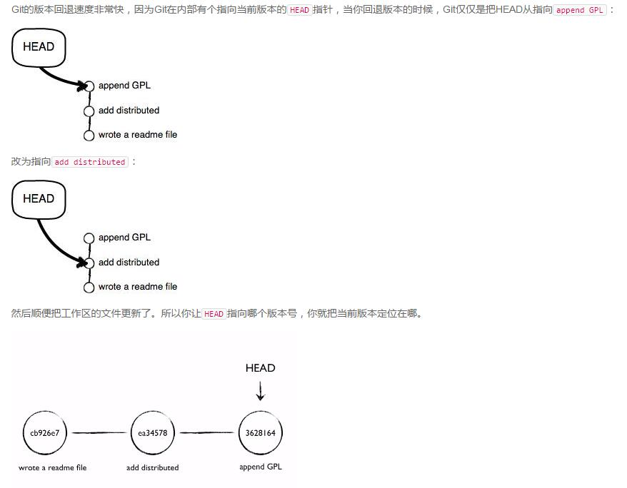
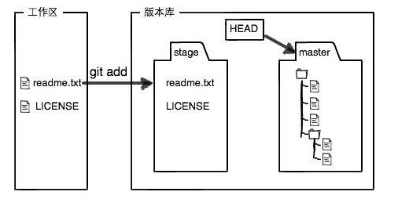
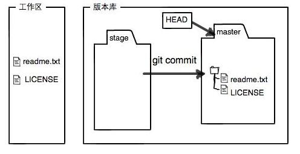

## git 学习总结
### 设置用户
```
$ git config --global user.name "Your Name"
$ git config --global user.email "email@example.com"
```
### 创建版本库
```
$ mkdir learngit
$ cd learngit
$ pwd
/Users/michael/learngit
$ git init
Initialized empty Git repository in /Users/michael/learngit/.git/
```

### 添加文件
```
$ git add readme.txt
$ git commit -m "wrote a readme file"
[master (root-commit) cb926e7] wrote a readme file
 1 file changed, 2 insertions(+)
 create mode 100644 readme.txt

$ git add file1.txt
$ git add file2.txt file3.txt
$ git commit -m "add 3 files."
```

### 查看状态
```
$ git status
# On branch master
# Changes not staged for commit:
#   (use "git add <file>..." to update what will be committed)
#   (use "git checkout -- <file>..." to discard changes in working directory)
#
#    modified:   readme.txt
#
no changes added to commit (use "git add" and/or "git commit -a")
```

### 查看修改
```
$ git diff readme.txt 
diff --git a/readme.txt b/readme.txt
index 46d49bf..9247db6 100644
--- a/readme.txt
+++ b/readme.txt
@@ -1,2 +1,2 @@
-Git is a version control system.
+Git is a distributed version control system.
 Git is free software.
```
### 显示提交log
```
$ git log
commit 3628164fb26d48395383f8f31179f24e0882e1e0
Author: Michael Liao <askxuefeng@gmail.com>
Date:   Tue Aug 20 15:11:49 2013 +0800

    append GPL

commit ea34578d5496d7dd233c827ed32a8cd576c5ee85
Author: Michael Liao <askxuefeng@gmail.com>
Date:   Tue Aug 20 14:53:12 2013 +0800

    add distributed

commit cb926e7ea50ad11b8f9e909c05226233bf755030
Author: Michael Liao <askxuefeng@gmail.com>
Date:   Mon Aug 19 17:51:55 2013 +0800

    wrote a readme file

$ git log --pretty=oneline   // 一行显示
3628164fb26d48395383f8f31179f24e0882e1e0 append GPL
ea34578d5496d7dd233c827ed32a8cd576c5ee85 add distributed
cb926e7ea50ad11b8f9e909c05226233bf755030 wrote a readme file
```
### 版本回退
```
$ git reset --hard HEAD^   //HEAD 当前版本， ^上一个，^^上上一个……
HEAD is now at ea34578 add distributed

$ git reset --hard 3628164 //版本号开头几位就可以
HEAD is now at 3628164 append GPL
//记录的每一次命令
$ git reflog
ea34578 HEAD@{0}: reset: moving to HEAD^
3628164 HEAD@{1}: commit: append GPL
ea34578 HEAD@{2}: commit: add distributed
cb926e7 HEAD@{3}: commit (initial): wrote a readme file
```

### 工作区与暂存区
```
第一步是用git add把文件添加进去，实际上就是把文件修改添加到暂存区；

第二步是用git commit提交更改，实际上就是把暂存区的所有内容提交到当前分支。
```



### 撤销修改
```
//未执行过add,即撤销工作区
$ git checkout -- readme.txt
//执行过add，即撤销暂存区
$ git reset HEAD readme.txt
Unstaged changes after reset:
M       readme.txt
```
### 删除文件
```
$ git rm test.txt
rm 'test.txt'
$ git commit -m "remove test.txt"
[master d17efd8] remove test.txt
 1 file changed, 1 deletion(-)
 delete mode 100644 test.txt
```
### 添加远程库
```
$ git remote add origin git@github.com:forthe2008/learn.git
$ git push -u origin master
Counting objects: 19, done.
Delta compression using up to 4 threads.
Compressing objects: 100% (19/19), done.
Writing objects: 100% (19/19), 13.73 KiB, done.
Total 23 (delta 6), reused 0 (delta 0)
To git@github.com:michaelliao/learngit.git
 * [new branch]      master -> master
Branch master set up to track remote branch master from origin.
由于远程库是空的，我们第一次推送master分支时，加上了-u参数，Git不但会把本地的master分支内容推送的远程新的master分支，还会把本地的master分支和远程的master分支关联起来，在以后的推送或者拉取时就可以简化命令。
$ git push origin master
```
### 克隆
```
$ git clone git@github.com:michaelliao/gitskills.git
Cloning into 'gitskills'...
remote: Counting objects: 3, done.
remote: Total 3 (delta 0), reused 0 (delta 0)
Receiving objects: 100% (3/3), done.

$ cd gitskills
$ ls
README.md
```

### 分支管理
```
查看分支：git branch
查看远程分支：git branch -a
创建分支：git branch <name>
切换分支：git checkout <name>
创建+切换分支：git checkout -b <name>
合并某分支到当前分支：git merge <name>
删除分支：git branch -d <name>
```
```
首先，我们创建dev分支，然后切换到dev分支：
$ git checkout -b dev
Switched to a new branch 'dev'
git checkout命令加上-b参数表示创建并切换，相当于以下两条命令：

$ git branch dev
$ git checkout dev
Switched to branch 'dev'
然后，用git branch命令查看当前分支：

$ git branch
* dev
  master
git branch命令会列出所有分支，当前分支前面会标一个*号。

然后，我们就可以在dev分支上正常提交，比如对readme.txt做个修改，加上一行：

Creating a new branch is quick.
然后提交：

$ git add readme.txt 
$ git commit -m "branch test"
[dev fec145a] branch test
 1 file changed, 1 insertion(+)
现在，dev分支的工作完成，我们就可以切换回master分支：
$ git checkout master
Switched to branch 'master'

现在，我们把dev分支的工作成果合并到master分支上：
$ git merge dev
Updating d17efd8..fec145a
Fast-forward
 readme.txt |    1 +
 1 file changed, 1 insertion(+)
git merge命令用于合并指定分支到当前分支。合并后，再查看readme.txt的内容，就可以看到，和dev分支的最新提交是完全一样的。
注意到上面的Fast-forward信息，Git告诉我们，这次合并是“快进模式”，也就是直接把master指向dev的当前提交，所以合并速度非常快。
当然，也不是每次合并都能Fast-forward，我们后面会讲其他方式的合并。
合并完成后，就可以放心地删除dev分支了：
$ git branch -d dev
Deleted branch dev (was fec145a).
删除后，查看branch，就只剩下master分支了：
$ git branch
* master
```

### 分支冲突
```
$ git merge feature1
Auto-merging readme.txt
CONFLICT (content): Merge conflict in readme.txt
Automatic merge failed; fix conflicts and then commit the result.

Git is a distributed version control system.
Git is free software distributed under the GPL.
Git has a mutable index called stage.
Git tracks changes of files.
<<<<<<< HEAD
Creating a new branch is quick & simple.
=======
Creating a new branch is quick AND simple.
>>>>>>> feature1

Creating a new branch is quick and simple.
$ git add readme.txt 
$ git commit -m "conflict fixed"
[master 59bc1cb] conflict fixed
```

### 创建标签
```
$ git branch
* dev
  master
$ git checkout master
Switched to branch 'master
$ git tag
v1.0
$ git tag v0.9 6224937

$ git show v0.9
commit 622493706ab447b6bb37e4e2a2f276a20fed2ab4
Author: Michael Liao <askxuefeng@gmail.com>
Date:   Thu Aug 22 11:22:08 2013 +0800

    add merge

创建标签
$ git tag v0.1 3628164

tag提交到远程服务器
$ git push origin v0.1.2 # 将v0.1.2标签提交到git服务器
$ git push origin –tags # 将本地所有标签一次性提交到git服务器

还可以创建带有说明的标签，用-a指定标签名，-m指定说明文字：

$ git tag -a v0.1 -m "version 0.1 released" 3628164
用命令git show <tagname>可以看到说明文字：

$ git show v0.1
tag v0.1
Tagger: Michael Liao <askxuefeng@gmail.com>
Date:   Mon Aug 26 07:28:11 2013 +0800

version 0.1 released

commit 3628164fb26d48395383f8f31179f24e0882e1e0
Author: Michael Liao <askxuefeng@gmail.com>
Date:   Tue Aug 20 15:11:49 2013 +0800

    append GPL
还可以通过-s用私钥签名一个标签：

$ git tag -s v0.2 -m "signed version 0.2 released" fec145a
签名采用PGP签名，因此，必须首先安装gpg（GnuPG），如果没有找到gpg，或者没有gpg密钥对，就会报错：

gpg: signing failed: secret key not available
error: gpg failed to sign the data
error: unable to sign the tag
如果报错，请参考GnuPG帮助文档配置Key。

用命令git show <tagname>可以看到PGP签名信息：

$ git show v0.2
tag v0.2
Tagger: Michael Liao <askxuefeng@gmail.com>
Date:   Mon Aug 26 07:28:33 2013 +0800

signed version 0.2 released
-----BEGIN PGP SIGNATURE-----
Version: GnuPG v1.4.12 (Darwin)

iQEcBAABAgAGBQJSGpMhAAoJEPUxHyDAhBpT4QQIAKeHfR3bo...
-----END PGP SIGNATURE-----

commit fec145accd63cdc9ed95a2f557ea0658a2a6537f
Author: Michael Liao <askxuefeng@gmail.com>
Date:   Thu Aug 22 10:37:30 2013 +0800

    branch test

```

### 删除标签
```
删除本地tag
git tag -d <tagname>

删除远程tag
git push origin --delete tag <tagname>
```


