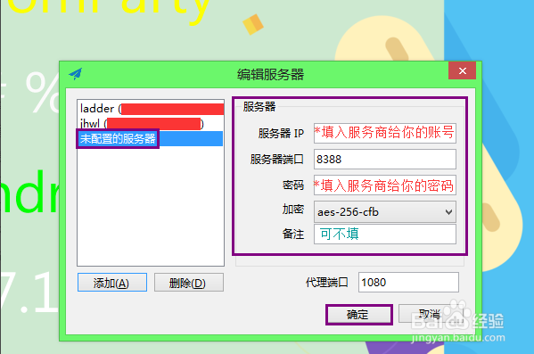

## 如何使用shadowsocks上Google
more detail see [link](https://github.com/forthe2008/shadowsocks)
#### 1.准备外国服务器，自行baidu
例如：http://banwagong.cn/ 
#### 2.安装shadowsocks server in 海外服务器
```
Server
Install
Debian / Ubuntu:
apt-get install python-pip
pip install shadowsocks
CentOS:
yum install python-setuptools && easy_install pip
pip install shadowsocks
Windows:
See Install Server on Windows
Usage
ssserver -p 443 -k password -m aes-256-cfb
To run in the background:
sudo ssserver -p 443 -k password -m aes-256-cfb --user nobody -d start
To stop:
sudo ssserver -d stop
To check the log:
sudo less /var/log/shadowsocks.log
Check all the options via -h. You can also use a Configuration file instead.
```
#### 3.安装shadowsocks clien in PC
[download link](http://pan.baidu.com/s/1bBWgge)

配置：

端口：-p 443
密码：-k password
IP ：网络服务器商提供
#### 4.安装shadowsocks clien in 安卓
[APP](http://pan.baidu.com/s/1hrJlxYG)
