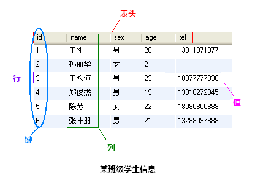

## Mysql 学习
### 概念
```
MySQL 为关系型数据库(Relational Database Management System), 这种所谓的"关系型"可以理解为"表格"的概念, 一个关系型数据库由一个或数个表格组成, 如图所示的一个表格:
```

```
表头(header): 每一列的名称;
列(row): 具有相同数据类型的数据的集合;
行(col): 每一行用来描述某个人/物的具体信息;
值(value): 行的具体信息, 每个值必须与该列的数据类型相同;
键(key): 表中用来识别某个特定的人\物的方法, 键的值在当前列中具有唯一性。
```
### 连接
```
本地连接
mysql -u root -p
Enter password:******

远程连接
mysql -h 10.0.0.1 -P 3306 -urunner -prunner123456 upyun_api

退出
mysql> exit
Bye

注：
mysql -h 主机名 -u 用户名 -p
-h : 该命令用于指定客户端所要登录的MySQL主机名, 登录当前机器该参数可以省略;
-u : 所要登录的用户名;
-p : 告诉服务器将会使用一个密码来登录, 如果所要登录的用户名密码为空, 可以忽略此选项。
以登录刚刚安装在本机的MySQL数据库为例, 在命令行下输入 mysql -u root -p 按回车确认, 如果安装正确且MySQL正在运行, 会得到以下响应:
Enter password:
若密码存在, 输入密码登录, 不存在则直接按回车登录, 按照本文中的安装方法, 默认 root 账号是无密码的。登录成功后你将会看到 Welecome to the MySQL monitor... 的提示语。
然后命令提示符会一直以 mysql> 加一个闪烁的光标等待命令的输入, 输入 exit 或 quit 退出登录。
```

### 创建数据库
```
命令：
create database 数据库名 [其他选项];

例子：
create database samp_db character set gbk;

查看创建的数据库：
show databases;
```

### 删除数据库
```
命令：
drop database 数据库名;

例子: 
drop database samp_db;
```

### 选择数据库
```
方法一: 在登录数据库时指定：
命令: mysql -D 所选择的数据库名 -h 主机名 -u 用户名 -p

例子：
mysql -D samp_db -u root -p

方法二: 在登录后使用 use 语句指定：
命令: use 数据库名;

实例：
mysql -h 10.0.0.1 -P 3306 -urunner -prunner123456 upyun_api
```

### 创建数据表
```
命令：
create table 表名称(列声明);

以创建 students 表为例, 表中将存放 学号(id)、姓名(name)、性别(sex)、年龄(age)、联系电话(tel) 这些内容:
	create table students
	（
		id int unsigned not null auto_increment primary key,
		name char(8) not null,
		sex char(4) not null,
		age tinyint unsigned not null,
		tel char(13) null default "-"
	);
				
从sql文件导入创建：
mysql -D samp_db -u root -p < createtable.sql
(提示: 1.如果连接远程主机请加上 -h 指令; 2. createtable.sql 文件若不在当前工作目录下需指定文件的完整路径。)

注：
create table tablename(columnTame columnType) 
为创建数据库表的命令, 列的名称以及该列的数据类型将在括号内完成;
括号内声明了5列内容, id、name、sex、age、tel为每列的名称, 后面跟的是数据类型描述, 列与列的描述之间用逗号(,)隔开;
以 "id int unsigned not null auto_increment primary key" 行进行介绍:
"id" 为列的名称;
"int" 指定该列的类型为 int(取值范围为 -8388608到8388607), 在后面我们又用 "unsigned" 加以修饰, 表示该类型为无符号型, 此时该列的取值范围为 0到16777215;
"not null" 说明该列的值不能为空, 必须要填, 如果不指定该属性, 默认可为空;
"auto_increment" 需在整数列中使用, 其作用是在插入数据时若该列为 NULL, MySQL将自动产生一个比现存值更大的唯一标识符值。在每张表中仅能有一个这样的值且所在列必须为索引列。
"primary key" 表示该列是表的主键, 本列的值必须唯一, MySQL将自动索引该列。
下面的 char(8) 表示存储的字符长度为8, tinyint的取值范围为 -127到128, default 属性指定当该列值为空时的默认值。

例子：
CREATE TABLE `text_audit` (
  `id` bigint(20) NOT NULL AUTO_INCREMENT,
  `task_id` varchar(50) NOT NULL DEFAULT '',
  `text` text NOT NULL,
  `label` int(11) NOT NULL DEFAULT '0',
  `review` varchar(10) NOT NULL DEFAULT '',
  `spam` double(10,9) NOT NULL DEFAULT '0.000000000',
  `normal` double(10,9) NOT NULL DEFAULT '0.000000000',
  `update_time` timestamp NOT NULL DEFAULT CURRENT_TIMESTAMP ON UPDATE CURRENT_TIMESTAMP,
  PRIMARY KEY (`id`),
  KEY `idx_lable` (`label`)
) ENGINE=InnoDB AUTO_INCREMENT=1001 DEFAULT CHARSET=utf8;
```
### 显示数据表
```
显示已创建命令：
show tables;

显示表详细信息命令：
describe 表名；
```
### 删除数据表
```
命令：
DROP TABLE table_name;

例子：
drop table text_audit;
```

### 重命名数据表
```
命令：
alter table 表名 rename 新表名;

例子：
alter table students rename workmates;
```
### 添加数据表列
```
命令：
alter table 表名 add 列名 列数据类型 [after 插入位置];

例子：
alter table students add address char(60); -- 最后加

alter table students add birthday date after age; -- age 后加
```
### 修改数据表列
```
命令：
alter table 表名 change 列名称 列新名称 新数据类型;

例子：
alter table students change tel telphone char(13) default "-";

alter table students change name name char(16) not null;
```
### 删除数据表列
```
命令：
alter table 表名 drop 列名称;

例子：
alter table students drop birthday;
```

### 插入数据
```
命令：
insert [into] 表名 [(列名1, 列名2, 列名3, ...)] values (值1, 值2, 值3, ...);


例子：
insert into students values(NULL, "王刚", "男", 20, "13811371377");

insert into students (name, sex, age) values("孙丽华", "女", 21);

```

### 查询数据
```
命令：
select 列名称 from 表名称 [where 条件];

例子：
mysql> select name, age from students;
	+--------+-----+
	| name   | age |
	+--------+-----+
	| 王刚   |  20 |
	| 孙丽华 |  21 |
	| 王永恒 |  23 |
	| 郑俊杰 |  19 |
	| 陈芳   |  22 |
	| 张伟朋 |  21 |
	+--------+-----+
	6 rows in set (0.00 sec)
	mysql>

命令：
select 列名称 from 表名称 where 条件;

例子：
select * from students where sex="女" ;

select * from students where age > 21;

select * from students where name like "%王%";  -- 名字带有王字

select * from students where id<5 and age>20;

注：
where 支持 =、>、<、>=、<、!= 以及一些扩展运算符 is [not] null、in、like 等等。 还可以对查询条件使用 or 和 and 进行组合查询
```

### 更新表中的数据
```
命令：
update 表名称 set 列名称=新值 [where 更新条件];

例子：
update students set tel=default where id=5;

update students set age=age+1;

update students set name="张伟鹏", age=19 where tel="13288097888";
```

### 删除表中的数据
```
命令：
delete from 表名称 where 删除条件;

例子：
delete from students where id=2;

delete from students where age<20;

delete from students; 删除所有数据
```

### UNION 子句：
```
MySQL UNION 操作符用于连接两个以上的 SELECT 语句的结果组合到一个结果集合中。多个 SELECT 语句会删除重复的数据。

m命令：
SELECT expression1, expression2, ... expression_n
FROM tables
[WHERE conditions]
UNION [ALL | DISTINCT]
SELECT expression1, expression2, ... expression_n
FROM tables
[WHERE conditions];
参数
expression1, expression2, ... expression_n: 要检索的列。
tables: 要检索的数据表。
WHERE conditions: 可选， 检索条件。
DISTINCT: 可选，删除结果集中重复的数据。默认情况下 UNION 操作符已经删除了重复数据，所以 DISTINCT 修饰符对结果没啥影响。
ALL: 可选，返回所有结果集，包含重复数据
```


